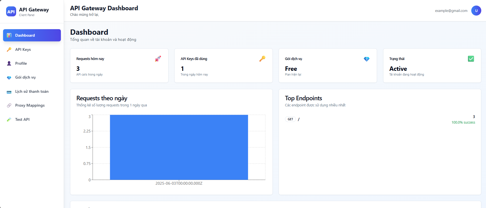
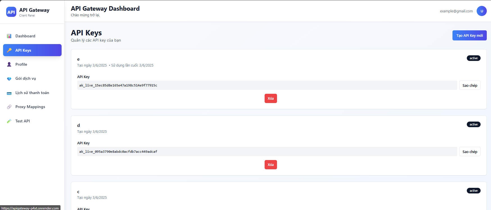
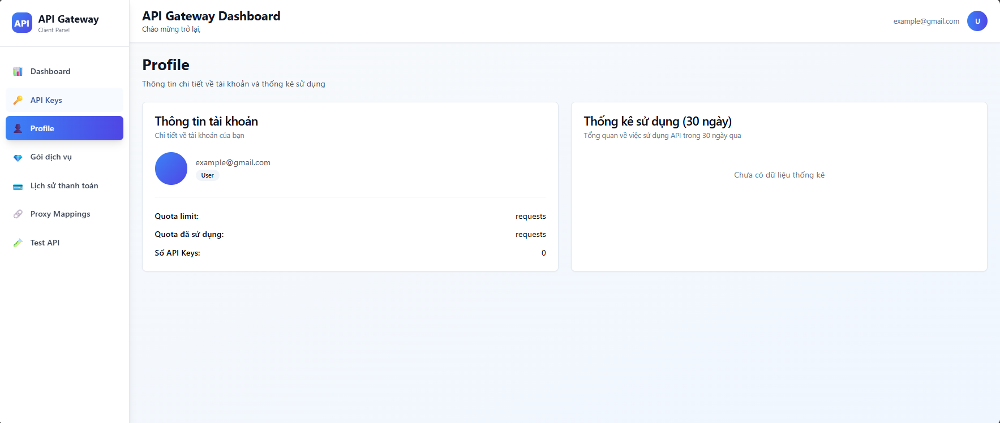
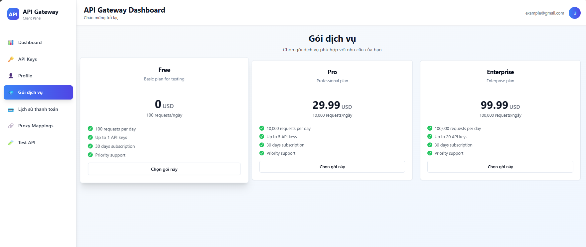
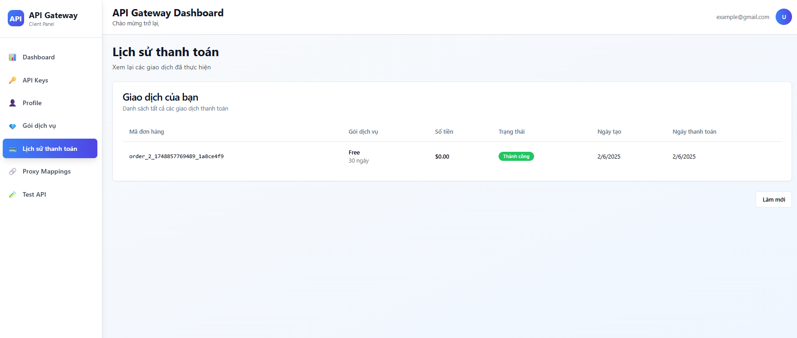
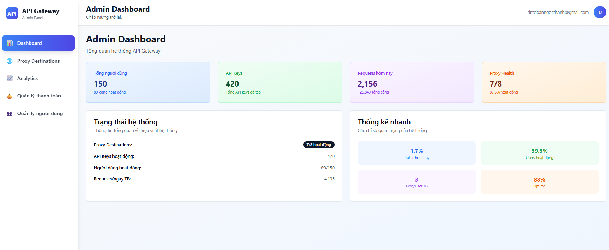
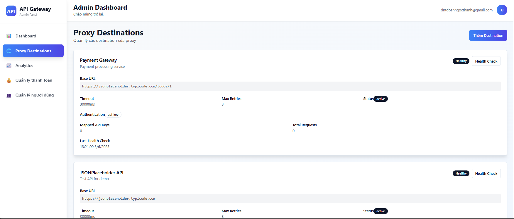
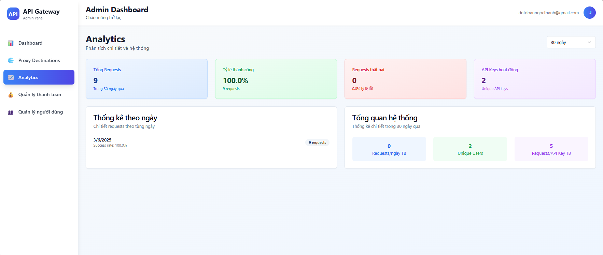
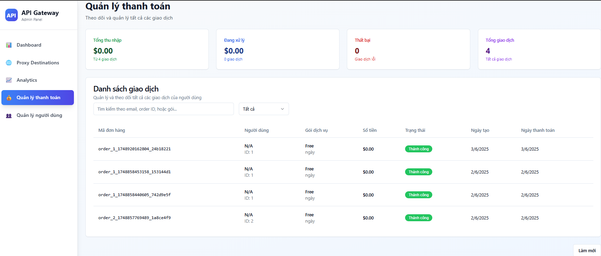
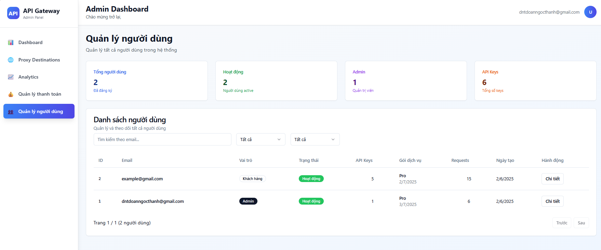

# ApiGateWay
[](https://apigateway-1k6n.onrender.com)
[](https://github.com/doanngocthanh/ApiGateWay)
[](https://github.com/doanngocthanh/ApiGateWay/issues)
[](https://github.com/doanngocthanh/ApiGateWay/network/members)

## 📋 Quick Start Instructions

1. **Initialize project:**
```bash
mkdir api-management-service
cd api-management-service
npm init -y
npm install express express-rate-limit express-validator bcryptjs jsonwebtoken pg redis cors helmet morgan uuid axios dotenv
npm install --save-dev nodemon jest
```

2. **Setup environment:**
```bash
cp .env.example .env
# Edit .env with your database and Redis credentials
```

3. **Start services:**
```bash
# With Docker
docker-compose up -d

# Or manually start PostgreSQL and Redis, then:
npm run dev
```

4. **Initialize database:**
```bash
psql -h localhost -U postgres -d api_management -f migrations/init.sql
```
 
[](https://github.com/doanngocthanh/ApiGateWay/blob/main/LICENSE)
[](https://github.com/doanngocthanh/ApiGateWay/commits/main)
[](https://github.com/doanngocthanh/ApiGateWay/actions)
[](https://github.com/doanngocthanh/ApiGateWay)
[](https://github.com/doanngocthanh/ApiGateWay)
[](https://github.com/doanngocthanh/ApiGateWay/graphs/contributors)
[](https://github.com/doanngocthanh/ApiGateWay/pulls)
## 📷 Project Images

Below are some images from the `images` folder to help you understand the project structure and features:

### Client Screenshots

- **Dashboard:**  
  
- **API Key:**  
  
- **Profile:**  
  
- **Plans:**  
  
- **Payment History:**  
  

### Admin Screenshots

- **Dashboard:**  
  
- **Destinations:**  
  
- **Analytics:**  
  
- **Payments:**  
  
- **Users:**  
  
 
> _Images are located in the `/images` directory._
